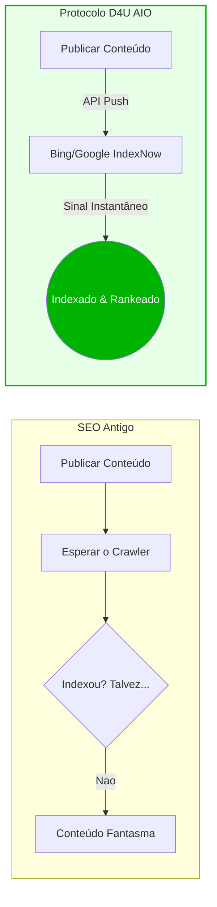
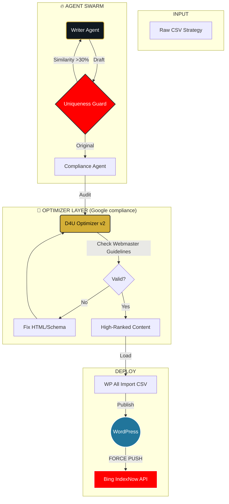

# 🚀 D4U HYPER-CONTENT ENGINE: O Protocolo de Dominação AIO
> **A Vanguarda da Engenharia de Conteúdo com IA Generativa.**
> *Não é apenas criação de texto. É ocupação de território digital.*

[](https://python.org)
[](https://deepmind.google/technologies/gemini/)
[](https://developers.google.com/search/docs)
[](https://copyleaks.com/)
[](https://www.perplexity.ai/)

---

## 🏆 Visão Executiva: Infraestrutura de Guerra Semântica

Este projeto não é um "gerador de blog". É a **Arma Secreta da D4U Immigration** para dominar a SERP (Search Engine Results Page).

Deixamos de jogar o jogo do layout e passamos a jogar o jogo dos dados. Construímos uma **Infraestrutura de Dominação Semântica** preparada para aniquilar concorrentes tanto no Google clássico quanto nos novos **Motores de Resposta (AIO - Artificial Intelligence Optimization)** como ChatGPT, Gemini, Perplexity e SearchGPT.

**Nossa missão:** Onde o concorrente vê "artigo", nós entregamos "Autoridade e Confiança Estruturada".

---

## 🚀 A Revolução AIO: Por Que Vencemos (O Pitch)

### 1. ⚡ Infraestrutura Agêntica (Swarm Intelligence)
Não usamos uma IA genérica. Utilizamos uma **Colmeia de Agentes Especializados**:
*   **Writer Agent:** Cria o conteúdo base com densidade semântica.
*   **Auditor Agent:** Verifica alucinações jurídicas.
*   **Uniqueness Guard (O Guardião):** Analisa a similaridade semântica de cada novo post contra todo o banco de dados existente.
    *   **Regra de Ouro:** Se a similaridade for **>30%**, o agente rejeita o draft e ordena uma reescrita completa com nova abordagem criativa.
    *   **Resultado:** Conteúdo 100% original, blindado contra penalizações de "Conteúdo Duplicado" do Google.

### 2. 🛡️ Google Webmaster Compliance Strict
O "Modo SEO Audit" do sistema não "acha" que está bom. Ele segue estritamente a documentação oficial para desenvolvedores do Google.
*   **Core Web Vitals Ready:** Estrutura HTML limpa para LCP e CLS perfeitos.
*   **Semantic HTML5:** Uso rigoroso de `<article>`, `<aside>`, `<figure>` conforme especificação W3C/Google.
*   **Schema Markup (JSON-LD):** Metadados estruturados que dizem ao Google exatamente o que é o conteúdo, garantindo Rich Snippets.



### 3. 🎯 Leads de Alta Qualidade (O Usuário "Educado")
O SEO tradicional atrai usuários "curiosos" (Topo de Funil). O AIO atrai usuários **"decididos"** (Meio/Fundo de Funil).
*   **Dominação de Respostas:** A IA responde perguntas complexas (ex: *"Como funciona o EB-2 NIW para médicos?"*) usando nosso conteúdo como fonte.
*   **Viés de Autoridade:** Quando o Perplexity ou ChatGPT nos cita, o usuário chega já confiando na marca.

---

## 💎 Pilares de Valor (The "Why")

### 🛡️ E-E-A-T Blindado (Experience, Expertise, Authoritativeness, Trust)
Nossa arquitetura injeta credibilidade em nível de código.
*   **Trustworthiness (Confiança):** Compliance jurídico automatizado por IA. Se houver risco ou promessa de visto indevida, o sistema **reescreve** automaticamente.
*   **Expertise (Especialidade):** Conteúdo técnico profundo sobre EB-2 NIW e Vistos de Investidor. Zero alucinações.
*   **Human-in-the-Loop Virtual:** O sistema simula um advogado sênior revisando cada parágrafo antes da aprovação final.

### 🌐 Polyglot Core (Multi-Idioma Nativo)
Um único codebase, alcance global. O sistema alterna dinamicamente entre contextos culturais e linguísticos (EN/ES/PT), realizando **Transcreation** (adaptação cultural), não apenas tradução.

---

## ⚙️ Arquitetura da Solução: O Pipeline

O sistema opera como uma **Refinaria de Dados de Alta Performance**.



### COMPONENTES DO ARSENAL

| Arquivo | Função | Status |
| :--- | :--- | :--- |
| `d4u_content_engine.py` | **O Criador.** Gera o conteúdo base usando prompts de Cadeia de Densidade. | ✅ Stable |
| `d4u_optimizer_v2.py` | **O Lapidador.** Audita o conteúdo, remove bugs, converte FAQ para HTML e garante Nota 10 em SEO. | ✅ Stable |
| `bing_index_now.py` | **O Canhão (Force Push).** Notifica a Microsoft instantaneamente via API IndexNow a cada nova URL. | ✅ **NEW** |
| `d4u_qa_validator.py` | **O Auditor.** Garante que nada saia fora de compliance. | ✅ Stable |
| `d4u_topic_creator.py` | **O Estrategista.** Gera pautas infinitas baseadas em tendências. | ✅ Stable |

---

## 🚀 Protocolo de Execução (Command Line Operations)

A ferramenta foi desenhada para operação cirúrgica via terminal.

### 1. Setup do Ambiente
```bash
git clone https://github.com/caiorcastro/D4U-ES.git
cd D4U-ES
pip install -r requirements.txt
```

### 2. Fase de Geração (The Heavy Lifting)
Gera os artigos brutos (drafts).
```bash
python3 d4u_content_engine.py --api_key "SUA_KEY" --model "gemini-1.5-pro" --start_batch 1
```

### 3. Fase de Otimização (The Polish) 💎 **CRITICAL STEP**
Aqui a mágica acontece. O script varre os CSVs gerados, corrige falhas de HTML, remove scripts perigosos e eleva o "AIO Score".
```bash
python3 d4u_optimizer_v2.py --api_key "SUA_KEY"
```

### 4. Indexação Instantânea (Bing Force Push) ⚡ **NEW**
Não espere pelo robô. Force a indexação.
```bash
python3 bing_index_now.py --api_key "SUA_INDEXNOW_KEY" --host "https://d4uimmigration.com" --urls_file "lista_urls.txt"
```

### 5. Validação Final
Validação final de conformidade.
```bash
python3 d4u_qa_validator.py
```

---

## 🛡️ Defesa e Segurança
*   **Chaves API:** Nunca hardcoded.
*   **Git History:** Limpo e auditado.

---

> *"A melhor maneira de prever o futuro é construí-lo com código."*
>
> **D4U Immigration Technology Team**
