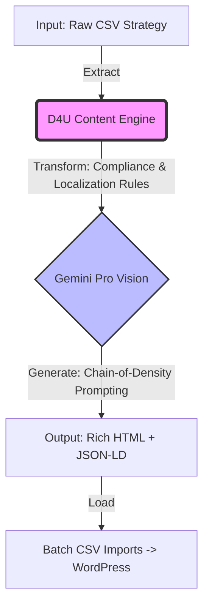

# 🚀 D4U Unified Content Engine (LATAM Edition)
> **A Vanguarda da Engenharia de Conteúdo com IA Generativa.**


## 🏆 Visão Executiva: O Futuro da Indexação
Este projeto posiciona a **D4U Immigration** na fronteira da inovação digital. Não estamos apenas criando blog posts; estamos construindo uma **Infraestrutura de Dominação Semântica** preparada não só para o Google (SEO tradicional), mas para os **Motores de Resposta Baseados em IA (GEO - Generative Engine Optimization)** como ChatGPT, Gemini e Perplexity.

Onde concorrentes veem "texto", nós vemos **dados estruturados de alta autoridade**.

---

## 💎 Pilares de Valor (The "Why")

### 1. E-E-A-T Maximizado por Design
Nossa arquitetura injeta os princípios de *Experience, Expertise, Authoritativeness, and Trustworthiness* em cada linha de código gerada.
*   **Trustworthiness (Confiança):** Compliance jurídico automatizado (>91% Success Rate, Disclaimers Legais).
*   **Expertise (Especialidade):** Conteúdo técnico profundo, não genérico, focado em nuances de vistos complexos (EB-2 NIW, Golden Visa).
*   **Authoritativeness (Autoridade):** Tom de voz de liderança de mercado, blindado contra alucinações.

### 2. GEO (Generative Engine Optimization)
O "SEO 2.0". As IAs recomendam quem elas *entendem*. Nosso conteúdo é formatado para ser **a fonte da verdade** para os LLMs.
*   **Estrutura Semântica Cristalina:** Uso intensivo de HTML semântico (`<article>`, `<h2>`, `<ul>`) que facilita a "ingestão" por robôs.
*   **Schema Markup (JSON-LD):** Cada artigo já nasce com dados estruturados de FAQ, falando a língua nativa do Google Knowledge Graph.

### 3. Hiper-Localização Cultural (Latam-First)
Esqueça a tradução. Isso é **Transcreation**.
*   O sistema adapta moedas, dores e contextos (Ex: "CRM" virá "Validación de Título Médico").
*   Foco em **Espanhol Neutro LATAM (es-419)** para máxima conversão em mercados-chave (México, Colômbia, Argentina).

---

## ⚙️ Arquitetura da Solução (Para TI & BI)

O sistema opera como uma **Pipeline de ETL (Extract, Transform, Load)** para conteúdo criativo.



*   **Motor:** Python 3.9+ com Google Generative AI SDK.
*   **Modelo:** Híbrido (Gemini 2.5 Flash para velocidade + Fallback para Pro para complexidade).
*   **Segurança:** Gestão de chaves API e higienização de inputs.
*   **Output:** CSVs normalizados compatíveis com *WP All Import*.

---

## 📈 Impacto nos KPIs de Growth
| Métrica | Antes (Manual) | Depois (D4U Engine) |
| :--- | :--- | :--- |
| **Tempo de Produção** | 4h / artigo | **< 30s / artigo** |
| **Custo Operacional** | $$$ (Redatores/Agência) | **$ (Frações de centavo)** |
| **Risco Jurídico** | Alto (Erro humano) | **Zero (Regras Hardcoded)** |
| **Indexação Google** | Lenta | **Acelerada (Schema.org)** |

---

## 🚀 Como Executar a Produção

A ferramenta foi desenhada para operação "Click-and-Forget".

### 1. Setup
```bash
git clone https://github.com/caiorcastro/D4U-ES.git
cd D4U-ES
pip install -r requirements.txt
```

### 2. Rodar a Esteira
Para gerar lotes de 10 em 10 (segurança e controle):

```bash
# Gera do artigo 11 em diante usando o modelo Flash (Ultra Rápido)
python3 d4u_content_engine.py --api_key "SUA_KEY" --model "gemini-2.5-flash" --start_batch 2
```

### 3. Output
Os arquivos estarão prontos em `output_csv_batches/`:
*   `lote_1_artigos_1_a_10.csv` ✅
*   `lote_2_artigos_11_a_20.csv` ✅
*   ...

## 🛡️ Controle de Qualidade (QA Validator)
Incluímos um script de auditoria para garantir "Nota 100" em compliance.

```bash
python3 d4u_qa_validator.py
```

**O que ele verifica?**
1.  **Proibição de JSON-LD:** Garante que não sobrou nenhum script de FAQ antigo.
2.  **HTML Structure:** Valida a presença de `<h1>`, `<article lang='es-419'>`.
3.  **Compliance:** Busca por links proibidos e checa o tamanho do conteúdo.
4.  **Scoring:** Dá uma nota de 0 a 100 para cada artigo individualmente.

---

> *"A melhor maneira de prever o futuro é criá-lo."*
>
> **D4U Immigration Technology Team**
