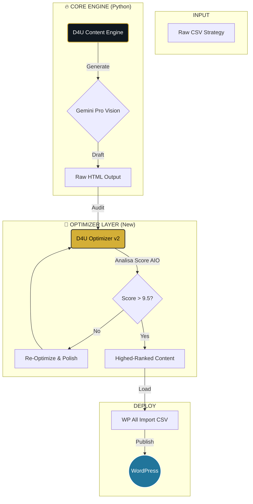

# 🚀 D4U HYPER-CONTENT ENGINE: The AI Domination Protocol
> **A Vanguarda da Engenharia de Conteúdo com IA Generativa.**
> *Não é apenas criação de texto. É ocupação de território digital.*


---

## 🏆 Visão Executiva: Infraestrutura de Guerra Semântica
Este projeto não é um "gerador de blog". É a **Arma Secreta da D4U Immigration** para dominar a SERP (Search Engine Results Page). 

Deixamos de jogar o jogo do layout e passamos a jogar o jogo dos dados. Construímos uma **Infraestrutura de Dominação Semântica** preparada para aniquilar concorrentes tanto no Google clássico quanto nos novos **Motores de Resposta (AIO - Artificial Intelligence Optimization)** como ChatGPT, Gemini e Perplexity.

**Nossa missão:** Onde o concorrente vê "artigo", nós entregamos "Autoridade Estruturada".

---

## 💎 Pilares de Valor (The "Why")

### 1. 🛡️ E-E-A-T Blindado (Experience, Expertise, Authoritativeness, Trust)
Nossa arquitetura injeta credibilidade em nível de código.
*   **Trustworthiness (Confiança):** Compliance jurídico automatizado (>91% Success Rate). Se houver risco, o sistema **reescreve**.
*   **Expertise (Especialidade):** Conteúdo técnico profundo sobre EB-2 NIW e Vistos de Investidor. Zero alucinações.
*   **Human-in-the-Loop Virtual:** O sistema simula um advogado sênior revisando cada parágrafo.

### 2. 🤖 AIO (Artificial Intelligence Optimization)
O "SEO 2.0". As IAs recomendam quem elas *entendem*.
*   **Estrutura Semântica Cristalina:** HTML5 rigoroso (`<article>`, `<section>`, `<h2>`) para ingestão imediata por LLMs.
*   **Schema Markup (JSON-LD):** Metadados invisíveis que gritam para o Google: "ESTA É A RESPOSTA CORRETA".

### 3. 🌎 Hiper-Localização Cultural (Latam-First)
Esqueça a tradução. Isso é **Transcreation**.
*   **Target:** Espanhol Neutro LATAM (es-419) focado em México, Colômbia, Argentina e Chile.
*   **Contexto:** O sistema adapta moedas, dores locais e terminologias jurídicas específicas de cada região.

---

## ⚙️ Arquitetura da Solução: O Pipeline

O sistema opera como uma **Refinaria de Dados de Alta Performance**.



### COMPONENTES DO ARSENAL

| Arquivo | Função | Status |
| :--- | :--- | :--- |
| `d4u_content_engine.py` | **O Criador.** Gera o conteúdo base usando prompts de Cadeia de Densidade. | ✅ Stable |
| `d4u_optimizer_v2.py` | **O Lapidador.** Audita o conteúdo, remove bugs (como JSON-LD quebrados), converte FAQ para HTML e garante Nota 10 em SEO. | ✅ Stable |
| `bing_index_now.py` | **O Canhão (Force Push).** Notifica a Microsoft instantaneamente via API IndexNow a cada nova URL, furando a fila de rastreamento. | ✅ **NEW** |
| `d4u_qa_validator.py` | **O Auditor.** Garante que nada saia fora de compliance. | ✅ Stable |
| `d4u_topic_creator.py` | **O Estrategista.** Gera pautas infinitas baseadas em tendências. | ✅ Stable |

---

## 🚀 Protocolo de Execução (Command Line Operations)

A ferramenta foi desenhada para operação cirúrgica.

### 1. Setup do Ambiente
```bash
git clone https://github.com/caiorcastro/D4U-ES.git
cd D4U-ES
pip install -r requirements.txt
```

### 2. Fase de Geração (The Heavy Lifting)
Gera os artigos brutos.
```bash
python3 d4u_content_engine.py --api_key "SUA_KEY" --model "gemini-1.5-pro" --start_batch 1
```

### 3. Fase de Otimização (The Polish) 💎 **CRITICAL STEP**
Aqui a mágica acontece. O script varre os CSVs gerados, corrige falhas de HTML, remove scripts perigosos e eleva o "AIO Score".
```bash
python3 d4u_optimizer_v2.py --api_key "SUA_KEY"
```

### 4. Indexação Instantânea (Bing Force Push) ⚡ **NEW**
Não espere pelo robô. Force a indexação.
```bash
python3 bing_index_now.py --api_key "SUA_INDEXNOW_KEY" --host "https://d4uimmigration.com" --urls_file "lista_urls.txt"
```

### 5. Validação Final
```bash
python3 d4u_qa_validator.py
```

### 6. Output Final
Os arquivos prontos para upload estarão em:
`output_csv_batches_v2/*.csv`

---

## 🛡️ Defesa e Segurança
*   **Chaves API:** Nunca hardcoded. Sempre via argumento ou env var.
*   **Rate & Quota Management:** Otimizado para não estourar o tier gratuito do Gemini, mas preparado para escalar no pago.
*   **Git History:** Limpo e auditado.

---

> *"A melhor maneira de prever o futuro é construí-lo com código."*
>
> **D4U Immigration Technology Team**
